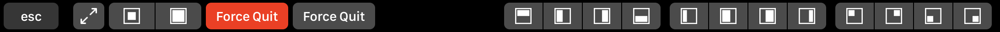
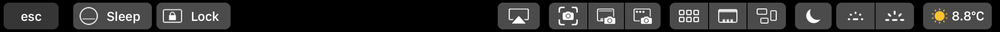
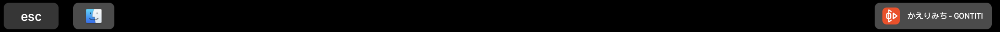
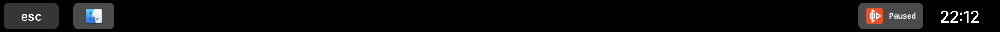
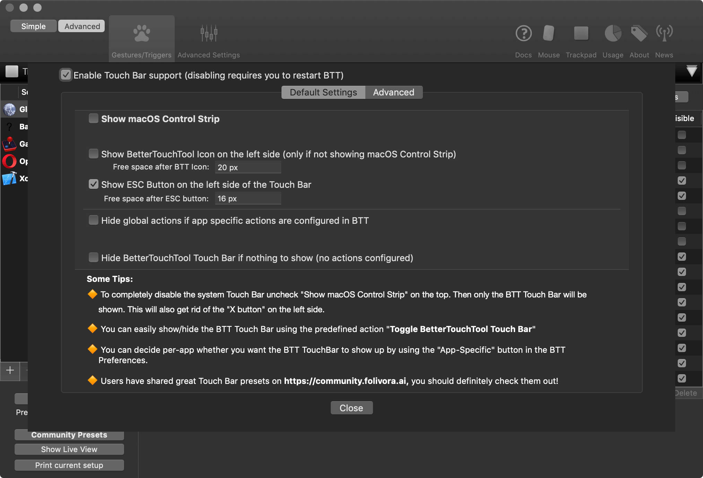

# BetterTouchTool Presets

[BetterTouchTool](https://www.folivora.ai) is one of the most prowerful productivity tool for macOS, which has been maintained for many years.

This repository contains my presets and some related tools.

## B9TouchBar

My touch bar preset inspired by [GoldenChaos-BTT](https://community.folivora.ai/t/goldenchaos-btt-a-complete-touch-bar-ui-replacement-preset/1281).

### Feature

- Powerful while keeping it simple.

    Actions are organized in a way that is easy to understand and maintain.
    No name triggers.
    No duplicate rules.

- Window control menu
    

- Option menu
    

- Media Control
    
    
    

- Game mode
    

- Energy efficient.

    Only run script at necessary time.
    No script widgets are executed periodically at this time. [ref](https://community.folivora.ai/t/updated-testing-the-battery-life-impact-of-applescript-widgets/3189)

- Other application presents

    Opera, Xcode

### Quick Reference

- Four finger swipe down or tap the BetterTouchTool (in Control Strip) button to toggle BTT touch bar.
- Hold <kbd>control</kbd> to show window control menu.
- Hold <kbd>option</kbd> to show system control menu.
- Hold <kbd>shift</kbd> for alternate oprations.
- If it looks like a button then you can tap it.

### Usage

- Go to [releases](https://github.com/BB9z/BetterTouchTool-B9Presets/releases) page to install.

    After inport triggers into your BetterTouchTool. You may need to restart BetterTouchTool before the touch bar present can work properly.

- Available out of the box, use it directly. Modify to meet your needs. There is no setting.

- Recommand setting:
    

- Two finger swipe to change volume, with <kbd>shift</kbd> can change screen brightness.

### Principle

- B9TouchBar is designed to complement the system touch bar, not a replacement.

- Avoid using third-party binary. Avoid additional installation steps.

- Never simulate a control strip as a replacement.

## BTTPresetBeautify

A command line tool to format BetterTouchTool preset files.

- Keeps JSON keys in order.
- Sort application group in preset file, keeps Global first.
- Make triggers in the same order as seen in BetterTouchTool app.

Usage:

```shell
BTTPresetBeautify input_path [output_path]
```

It will overwrite the original file if no output path is specified.

[Download](https://github.com/BB9z/BetterTouchTool-B9Presets/releases/tag/beautify_v1.0)
